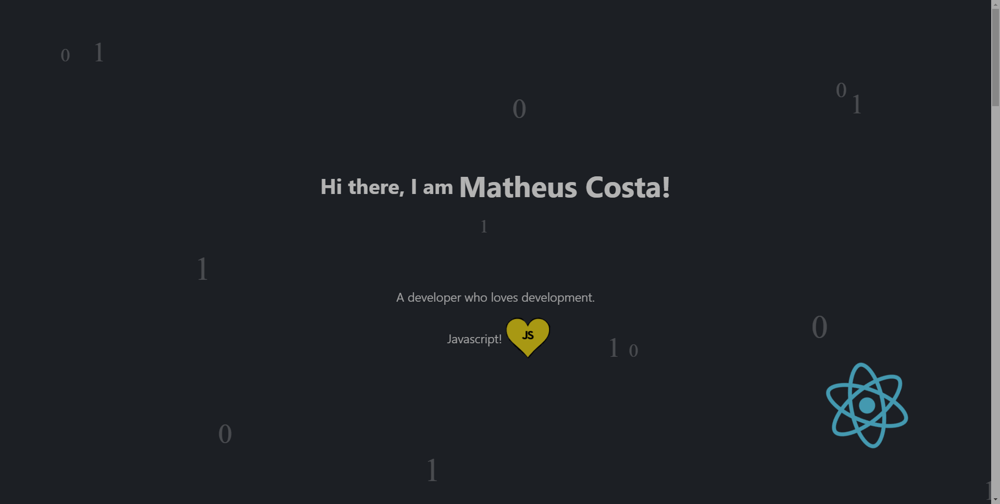
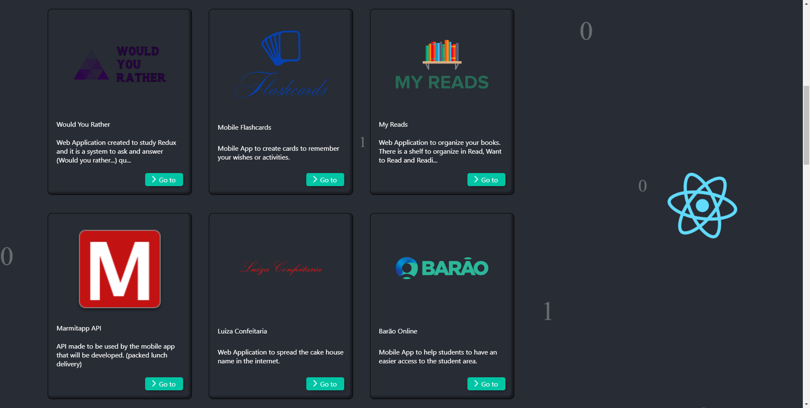
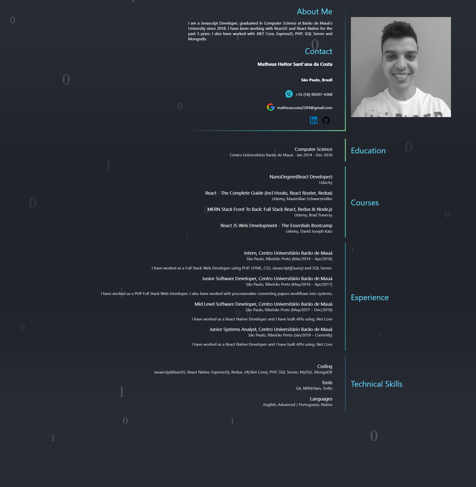

# my-custom-profile
My custom profile is a web page to show more about the person, skills and education.
It's made using a parallax effect in hole page to animate page transitions.

## Demo
[DemoLink](https://matheuscosta2204.github.io/my-custom-profile/)





## Installation

First, clone the repo in your machine using git

```bash
git clone https://github.com/matheuscosta2204/my-custom-profile.git && cd my-custom-profile
```

Second, install node_modules using npm or yarn

NPM
```bash
npm install
```

YARN
```bash
yarn
```

Third, to start running

```bash
yarn start
```

## Contributing
Pull requests are welcome. For major changes, please open an issue first to discuss what you would like to change.

Please make sure to update tests as appropriate.

## License
[MIT](https://choosealicense.com/licenses/mit/)